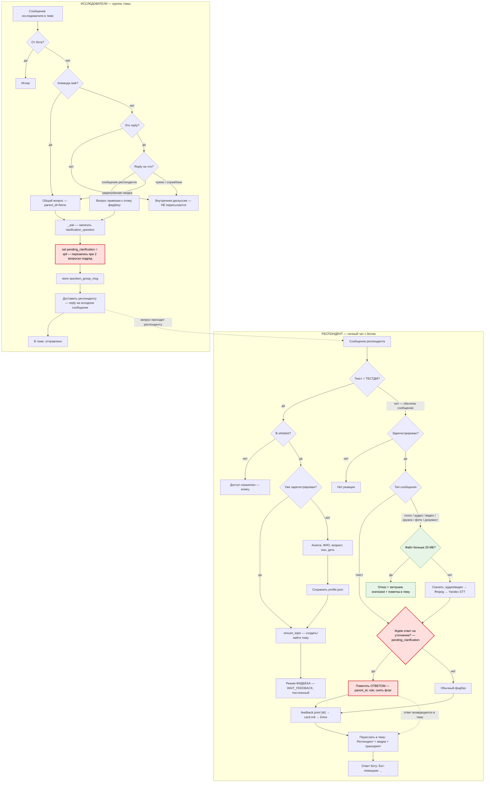

# Логика взаимодействия: респондент ↔ бот ↔ исследователи

> Текущее состояние (что в коде сейчас). 🔴 красным — проблемные зоны, 🟢 зелёным — недавно укреплённое.
> Диаграмма рендерится автоматически на GitHub. Можно также вставить код-блок в https://mermaid.live

## Проблемные зоны (🔴 красные узлы)

Все три красных узла — это **один механизм привязки ответа**: `pending_clarification[user] = qid`.

1. **SETP — перезапись.** Хранится только ОДИН ожидаемый ответ на пользователя. Два вопроса подряд → второй затирает первый. Первый вопрос в данных останется без ответа.
2. **PEND / TAGANS — мис-атрибуция.** «Следующее сообщение = ответ» — догадка. Если респондент после вопроса прислал спонтанное сообщение (не ответ), оно всё равно пометится `clarification_answer` и приклеится к чужому вопросу.

## Куда встроится решение Y (обсуждается)

Заменяем красный механизм на **явное управление тредом ответа**:
- **Открытие треда:** respondent делает reply на вопрос **или** жмёт кнопку «Ответить» под ним → бот знает, на какой именно вопрос идёт ответ.
- **Сбор ответа:** все сообщения (текст + скриншот + скринкаст, без таймера) привязываются к этому вопросу, пока тред открыт.
- **Закрытие:** кнопка «✅ Завершить ответ» (+ новый вопрос закрывает прошлый тред; опц. бэкстоп).
- **Страховка исследователя:** кнопка «↩️ Вынести из треда» на пересланном сообщении → исправляет данные И закрывает тред у респондента + уведомляет его.

Это убирает узлы PEND/TAGANS/SETP и заменяет их на детерминированную привязку по `message_thread`-подобному контексту (на уровне нашего bot_data, без topics в личке).

## Прочие найденные проблемы (вне этой схемы, из ревью)
- `/cancel` завершает диалог → после него сообщения не ловятся (рассогласование с «постоянным» `/stop`).
- Whitelist проверяется только при регистрации.
- Неатомарная запись `profile.json` / `card.md`; гонка при одновременных дозаписях.
- `regenerate_card` пересобирает карточку на каждое сообщение (O(n²) на длинном диалоге).
- Безграничный рост `msgmap` / `question_group_msg` в pickle.
